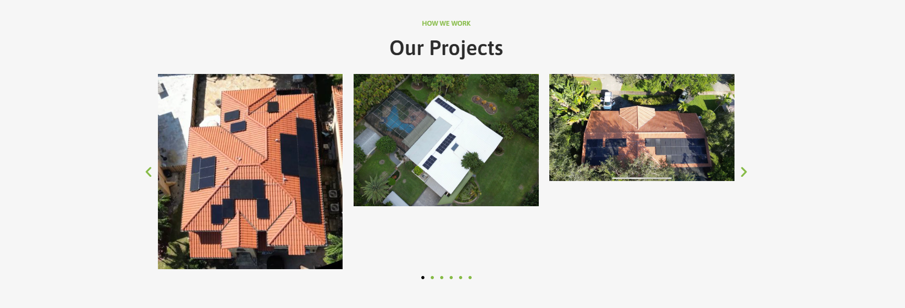

#### My client asked me to fix the size of Elementor image carousel which include a lot of images of different size. The problem here is to scale down the other's image size to a minimum image size.



#### To achieve this using python
* From elementor carousel set the image size full.
* Run the script on google colab or a local machine.
Packages:
```
Pillow==10.1.0
requests-html==0.10.0
```
* After getting minimum width and height set elementor image carousel size to minimum
